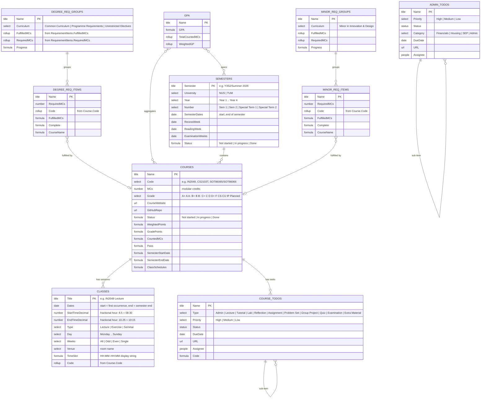

# Notion Schema: School Dashboard & Personal Dashboard ERD

> **Status**: Fully confirmed from the API (School Dashboard + Personal Dashboard integrations).
> Last updated: 2026-04-27.

## School Dashboard ERD



---

## Personal Dashboard ERD

```mermaid
erDiagram
    TRANSACTIONS {
        title   Name            PK  "auto: Merchant — Amount SGD"
        date    Date                "exact datetime, Asia/Singapore"
        number  Amount              "SGD format, always positive"
        select  Direction           "Debit | Credit"
        select  Category            "Food | Transport | Groceries | Bills | Subscriptions | Travel | Shopping | Income | Other"
        select  Source              "Wise | OCBC"
        text    Merchant
        text    ExternalID          "Wise transaction id — dedup key"
        formula Month               "formatDate(Date, YYYY-MM)"
        text    Notes               "raw payload / audit"
    }

    PERSONAL_TODOS {
        title  Name             PK
        status Status               "Not started | In progress | Done"
        select Priority             "High | Medium | Low"
        date   DueDate
        formula Warning             "overdue indicator"
        url    URL
        people Assignee
    }

    FASHION_WISHLIST {
        title  Name             PK
        select Status               "Wishlisting | Purchased | Passed"
        select Brand                "Uniqlo | Zara | COS | Acne Studios | Arket | Nike | New Balance | Adidas | Salomon | Other"
        select Category             "T-Shirts | Polo Shirts | Shirts | Shorts | Pants | Outerwear | Footwear | Accessories | Bags | Gym & Lounge Wear"
        select Size                 "XS | S | M | L | XL"
        number PriceSGD             "SGD format"
        url    URL
    }

    MISCELLANEOUS_WISHLIST {
        title  Name             PK
        select Status               "Wishlisting | Purchased | Passed"
        select Brand                "Uniqlo | Zara | COS | Acne Studios | Arket | Nike | New Balance | Adidas | Salomon | Other"
        select Category             "Technology"
        number PriceSGD             "SGD format"
        url    URL
    }

    PERSONAL_TODOS     ||--o{ PERSONAL_TODOS   : "sub-item"
```



---

## Database Reference

### Semesters

**Data Source ID**: `33d9080d-a147-8048-819c-000b3f1a4d1d`  
**Database ID**: `33d9080d-a147-80bc-b7b8-ca356e4c928e`

Tracks all academic semesters across NUS and TUM. Current data spans Y1S1 (Aug 2023) through Y4S2 (May 2027), with the active semester being Y3S2/Summer 2026 at TUM.

| Property | Type | Values / Notes |
| --- | --- | --- |
| Semester | title | e.g. `Y3S2/Summer 2026` |
| University | select | `NUS`, `TUM` |
| Year | select | `Year 1`…`Year 4` |
| Number | select | `Sem 1`, `Sem 2`, `Special Term 1`, `Special Term 2` |
| Semester Dates | date | Start–end of the full semester |
| Recess Week | date | |
| Reading Week | date | |
| Examination Weeks | date | |
| Status | formula | `"Not started"` / `"In progress"` / `"Done"` derived from `Semester Dates` |
| Courses | relation | → Courses (backlink) |
| Total MCs | rollup | sum of Courses.MCs |
| Counted MCs | rollup | sum of Courses.CountedMCs |
| Weighted Points | rollup | sum of Courses.WeightedPoints |

---

### Courses

**Data Source ID**: `33d9080d-a147-80f1-91a1-000b0a393b27`  
**Database ID**: `33d9080d-a147-806d-8b04-c0f0516bac16`

One row per enrolled course across all semesters and universities.

| Property | Type | Notes |
| --- | --- | --- |
| Name | title | Full course name |
| Code | select | Course code (e.g. `IN2049`, `CS2103T`, `SOT86065/SOT86066`) |
| Semester | relation | → Semesters |
| MCs | number | Modular credits / ECTS |
| Grade | select | `A+`…`F`, `CS`, `CU`, `IP`, `Planned` |
| Course Website | url | |
| GitHub Repo | url | Added by `setup-semester`; links to course GitHub repo |
| Classes | relation | → Classes (backlink) |
| Degree Requirement Items | relation | → Degree Requirement Items |
| Minor Requirement Items | relation | → Minor Requirement Items |
| Status | formula | `"Not started"` / `"In progress"` / `"Done"` derived from linked Semester's Status |
| Weighted Points, Grade Points, Counted MCs, Pass | formula | GPA computation fields |
| Semester Start/End Date, Class Schedules | formula | Derived display fields |

**Active TUM courses (Y3S2/Summer 2026)**:

| Code | Name | Page ID |
| --- | --- | --- |
| `IN2049` | Logic | `33e9080d-a147-809f-bb25-f14f48f37e92` |
| `IN2228` | 3D Computer Vision | `33e9080d-a147-8007-b760-cd77ea836580` |
| `SOT86065/SOT86066` | Machine Learning and Society | `33e9080d-a147-80ac-b49d-cd6d6faca524` |

---

### Classes

**Data Source ID**: `33d9080d-a147-809a-a8d6-000b74ccf447`  
**Database ID**: `33d9080d-a147-80e6-a934-c7f5cf7501f8`  
**Env var**: `NOTION_CLASSES_DB_ID`

One row per scheduled class session (lecture, exercise, seminar). This is the primary source for the ICS export.

| Property | Type | Notes |
| --- | --- | --- |
| Title | title | `"{CODE} {Type}"` e.g. `IN2049 Lecture` |
| Course | relation | → Courses (property ID `qiVy`) |
| Code | rollup | `show_original` of `Course.Code` |
| Dates | date | `.start` = first occurrence; `.end` = semester end (null for Single) |
| Start Time (Decimal) | number | `8.5` → 08:30, `10.25` → 10:15 |
| End Time (Decimal) | number | Same encoding |
| Type | select | `Lecture`, `Exercise`, `Seminar` |
| Day | select | `Monday`…`Sunday` |
| Weeks | select | `All`, `Odd`, `Even`, `Single` |
| Venue | select | Full room name |
| Time Slot | formula | `HH:MM–HH:MM` derived from decimal times |

**RRULE logic** (in `src/notion_automations/ics_export.py`):

| Weeks | RRULE |
| --- | --- |
| `All` | `FREQ=WEEKLY;BYDAY={day}` |
| `Odd` or `Even` | `FREQ=WEEKLY;INTERVAL=2;BYDAY={day};WKST=MO` |
| `Single` | no RRULE |

`UNTIL` = `Dates.end`, or max `Dates.end` across all rows as fallback, converted to UTC per RFC 5545.

---

### Course To-Dos

**Data Source ID**: `33d9080d-a147-8093-ab2d-000bd2b04c53`  
**Database ID**: `33d9080d-a147-8001-b1e5-decc1f191c26`

Hierarchical task list scoped to individual courses (lectures, assignments, etc.).

| Property | Type | Values |
| --- | --- | --- |
| Name | title | Task name |
| Course | relation | → Courses |
| Type | select | `Admin`, `Lecture`, `Tutorial`, `Lab`, `Reflection`, `Assignment`, `Problem Set`, `Group Project`, `Quiz`, `Examination`, `Extra Material` |
| Priority | select | `High`, `Medium`, `Low` |
| Status | status | |
| Due Date | date | |
| URL | url | |
| Assignee | people | |
| Parent item / Sub-item | relation | → self (hierarchical tasks) |
| Code | formula | Derived from Course.Code |

---

### Admin To-Dos

**Data Source ID**: `33d9080d-a147-81be-b7c2-000b1d69d515`  
**Database ID**: `33d9080d-a147-8070-bc49-f31d9d573259`

Non-academic administrative tasks (housing, financials, exchange programme admin, etc.).

| Property | Type | Values |
| --- | --- | --- |
| Name | title | Task name |
| Category | select | `Financials`, `Housing`, `SEP`, `Admin` |
| Priority | select | `High`, `Medium`, `Low` |
| Status | status | |
| Due Date | date | |
| URL | url | |
| Assignee | people | |
| Parent item / Sub-item | relation | → self (hierarchical tasks) |

---

### Degree Requirement Groups

**Data Source ID**: `33e9080d-a147-808d-a1d6-000b91b2ecfb`  
**Database ID**: `33e9080d-a147-8004-882b-fb9fd12eac12`

Top-level groupings of degree requirements (e.g. Common Curriculum, Programme Requirements).

| Property | Type | Notes |
| --- | --- | --- |
| Name | title | Group name |
| Curriculum | select | `Common Curriculum`, `Programme Requirements`, `Unrestricted Electives` |
| Requirement Items | relation | → Degree Requirement Items |
| Fulfilled MCs | rollup | |
| Required MCs | rollup | |
| Progress | formula | |

---

### Degree Requirement Items

**Data Source ID**: `33d9080d-a147-80b5-80ec-000b13f5c5e6`  
**Database ID**: `33d9080d-a147-8055-9a7d-d9e9ea7a5dd4`

Individual requirements within a degree group, each optionally linked to a course.

| Property | Type | Notes |
| --- | --- | --- |
| Name | title | Requirement name |
| Group | relation | → Degree Requirement Groups |
| Course | relation | → Courses (which course fulfils this) |
| Required MCs | number | |
| Code | rollup | from Course.Code |
| Fulfilled MCs, Complete, Course Name | formula | |

---

### Minor Requirement Groups

**Data Source ID**: `33e9080d-a147-8100-8c5e-000bcda820e0`  
**Database ID**: `33e9080d-a147-8035-aa31-f2a54c5e0d10`

Top-level groupings for minor requirements (e.g. Minor in Innovation & Design).

| Property | Type | Notes |
| --- | --- | --- |
| Name | title | |
| Curriculum | select | `Minor in Innovation & Design` |
| Minor Requirement Items | relation | → Minor Requirement Items |
| Requirement Items | relation | → Degree Requirement Items |
| Fulfilled MCs | rollup | |
| Required MCs | rollup | |
| Progress | formula | |

---

### Minor Requirement Items

**Data Source ID**: `33e9080d-a147-817a-8d4e-000b4f908692`  
**Database ID**: `33e9080d-a147-80bb-8620-ed738aa26701`

Individual requirements for a minor, linked to courses.

| Property | Type | Notes |
| --- | --- | --- |
| Name | title | |
| Group | relation | → Minor Requirement Groups |
| Course | relation | → Courses |
| Required MCs | number | |
| Code | rollup | from Course.Code |
| Fulfilled MCs, Complete, Course Name | formula | |

---

### Grade Point Average

**Data Source ID**: `33d9080d-a147-80a5-b7ff-000b2a470190`  
**Database ID**: `33d9080d-a147-80d3-8dd5-db13a464dc8d`

Aggregation view computing GPA across a set of courses and semesters.

| Property | Type | Notes |
| --- | --- | --- |
| Name | title | e.g. `Cumulative GPA` |
| Courses | relation | → Courses (which courses to include) |
| Semesters | relation | → Semesters (which semesters to include) |
| Weighted GP | rollup | sum of Courses.WeightedPoints |
| Total Counted MCs | rollup | sum of Courses.CountedMCs |
| GPA | formula | WeightedGP / TotalCountedMCs |

---

### Transactions *(Personal Dashboard → Finances)*

**Database ID**: `34f9080d-a147-80c1-ba01-e9fbfd180524`  
**Data Source ID**: `34f9080d-a147-8008-9a9e-000b8a398d11`

One row per financial transaction from Wise (and eventually OCBC). All amounts in SGD.

| Property | Type | Notes |
| --- | --- | --- |
| Name | title | Auto-filled: `"{Merchant} — {Amount} SGD"` |
| Date | date | Exact datetime, Asia/Singapore timezone |
| Amount | number | SGD, always positive |
| Direction | select | `Debit`, `Credit` |
| Category | select | `Food`, `Transport`, `Groceries`, `Bills`, `Subscriptions`, `Travel`, `Shopping`, `Income`, `Other` |
| Source | select | `Wise`, `OCBC` |
| Merchant | rich text | |
| External ID | rich text | Wise transaction `id` — deduplication key |
| Month | formula | `formatDate(Date, "YYYY-MM")` — for grouping only |
| Notes | rich text | Raw payload / audit trail |

---

### Personal To-Dos *(Personal Dashboard)*

**Data Source ID**: `3499080d-a147-814a-93a5-000ba80ccb85`  
**Database ID**: `3499080d-a147-8015-b0d8-d34f98f12ad1`

General personal task list, separate from the school-scoped Course/Admin To-Dos.

| Property | Type | Values |
| --- | --- | --- |
| Name | title | |
| Status | status | `Not started`, `In progress`, `Done` |
| Priority | select | `High`, `Medium`, `Low` |
| Due Date | date | |
| Warning | formula | `"⚠️"` when overdue, else `""` |
| URL | url | |
| Assignee | people | |
| Parent item / Sub-item | relation | → self (hierarchical tasks) |

---

### Fashion Wishlist *(Personal Dashboard → Shopping)*

**Database ID**: `34c9080d-a147-8177-a4e3-d04c0e29349a`

Clothing and accessory wishlist with purchase tracking.

| Property | Type | Values |
| --- | --- | --- |
| Name | title | |
| Status | select | `Wishlisting`, `Purchased`, `Passed` |
| Brand | select | `Uniqlo`, `Zara`, `COS`, `Acne Studios`, `Arket`, `Nike`, `New Balance`, `Adidas`, `Salomon`, `Other` |
| Category | select | `T-Shirts`, `Polo Shirts`, `Shirts`, `Shorts`, `Pants`, `Outerwear`, `Footwear`, `Accessories`, `Bags`, `Gym & Lounge Wear` |
| Size | select | `XS`, `S`, `M`, `L`, `XL` |
| Price (SGD) | number | SGD format |
| URL | url | |

---

### Miscellaneous Wishlist *(Personal Dashboard → Shopping)*

**Database ID**: `34f9080d-a147-80d9-b2a4-f852a53bc255`

Non-fashion wishlist (currently technology items).

| Property | Type | Values |
| --- | --- | --- |
| Name | title | |
| Status | select | `Wishlisting`, `Purchased`, `Passed` |
| Brand | select | Same options as Fashion Wishlist |
| Category | select | `Technology` |
| Price (SGD) | number | SGD format |
| URL | url | |

---

## Inaccessible Databases

Two databases in the Personal Dashboard are not shared with the integration and cannot be read via the API. They appear in the main page body (not the Appendix).

| Block ID | Location | Title |
| --- | --- | --- |
| `3499080d-a147-80d2-a756-c27ee5563db2` | Personal Dashboard (top) | Untitled |
| `34c9080d-a147-8033-9742-d71c353f90c7` | Personal Dashboard → Shopping | Untitled |

To make these accessible: share them with the integration in Notion settings.

---

## CLI Integration

The `na` CLI (`src/notion_automations/cli.py`) uses the following
fetch functions from `src/notion_automations/notion.py`:

| Function | Source DB | Used for |
| --- | --- | --- |
| `fetch_classes_db(db_id)` | Classes | All ICS exports; `db_id` from `NOTION_CLASSES_DB_ID` |
| `fetch_courses_db()` | Courses | Interactive course filter in `--open` command |
| `fetch_semesters_db()` | Semesters | Interactive semester filter in `--open` command |

The interactive filter chain:

```text
Semester filter: Semesters.Courses[].id → match Classes.Course[].id
Course filter:   Courses page IDs       → match Classes.Course[].id
```
